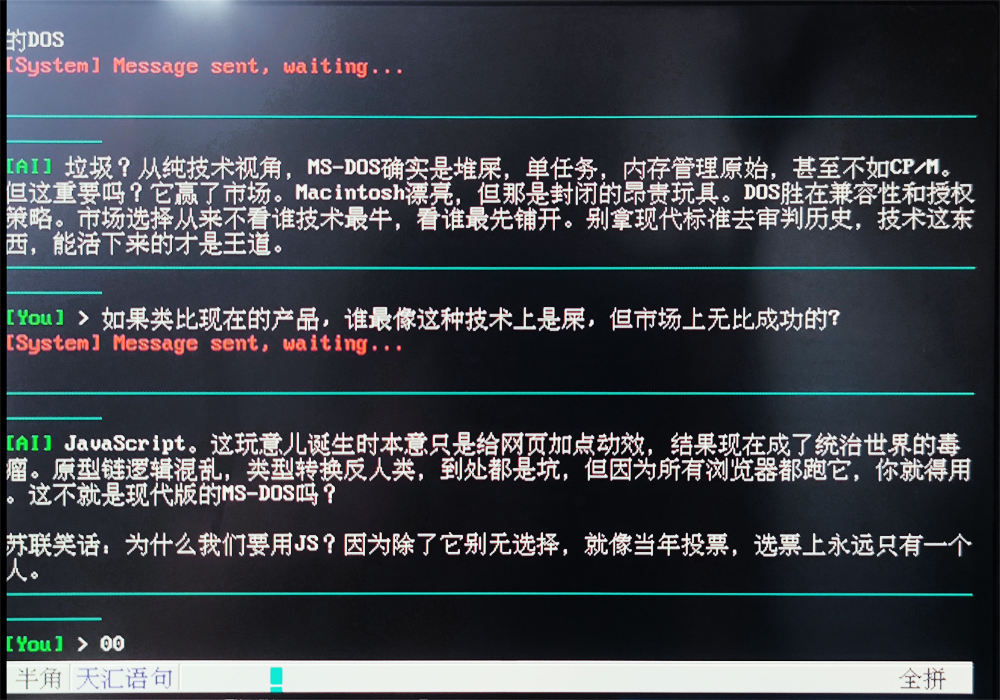
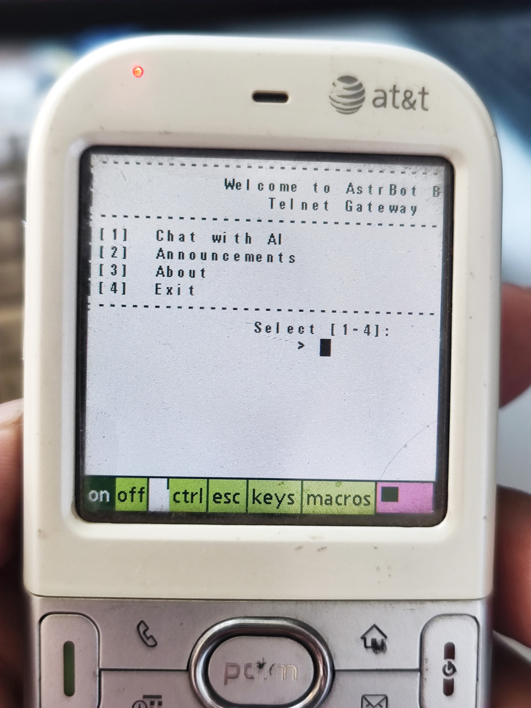

# AstrBot Telnet Gateway

当下的 AI 应用和网页版无法支持比较陈旧的系统，而 Telnet 是一个源于1969年，一直被广泛支持的长寿协议。本插件使 DOS、Win9x、黑莓、Palm 等老系统可以通过 Telnet 体验 AI 对话。

## 核心特性

- 🖥️ **BBS 界面** — ASCII 框线 + ANSI 16 色，模仿 90 年代 BBS 经典味道
- 🔐 **密码认证** — 可选，防陌生人
- 🌐 **编码可配置** — 默认 GBK（兼容 Win9x 等老系统），UTF-8 可在配置里切换
- ⌨️ **兼容古董终端** — 回显、行宽等可手动配置以兼容古董终端

## 截图预览

## 配置

| 参数 | 默认值 | 说明 |
|------|--------|------|
| 监听地址 | 0.0.0.0 | 监听所有接口 |
| 端口 | 2323 | Telnet 服务端口 |
| 汉字编码 | gbk | 简中老终端 gbk；繁中老终端 big5；现代 utf-8 |
| 连接密码 | (空) | 留空不验证 |
| 回声模式  | server | server = 开启IAC，服务器回显（推荐）；client = 关闭IAC，需在终端中开启本地回显 |
| 窗口宽度 | 0 | 如果IAC未能获取窗口宽度导致行尾汉字被截断，可在此手动指定宽度 |
| 汉字后加空格  | 关 | 改善以半宽显示汉字的旧终端可读性 |

## 兼容性

已测试终端：
- **mTCP Telnet** (DOS) ✅
- **超级终端** (Windows 9x) ✅
- **Termius** (Android) ✅
- **Windows 11 telnet** ✅ (需启用 Telnet 客户端)
- **MochaTelnet** (PalmOS) ✅ 不能输入和显示中文
- **PocketPutty** (WM6) ✅ 不能输入和显示中文
- **ConnectBot**(BBOS10) ✅ 物理键盘不能输入中文

老旧设备建议开启 AstrBot 分段发送功能，避免长回复导致假死。

> ⚠️ Telnet 没有加密机制，避免在公网上暴露端口。